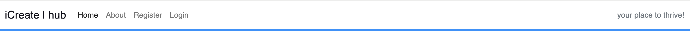
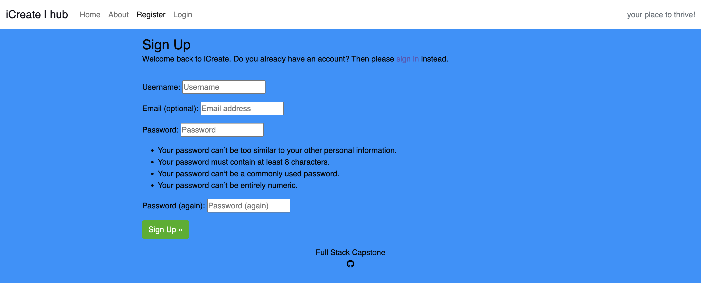
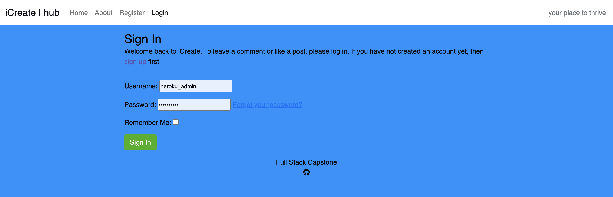
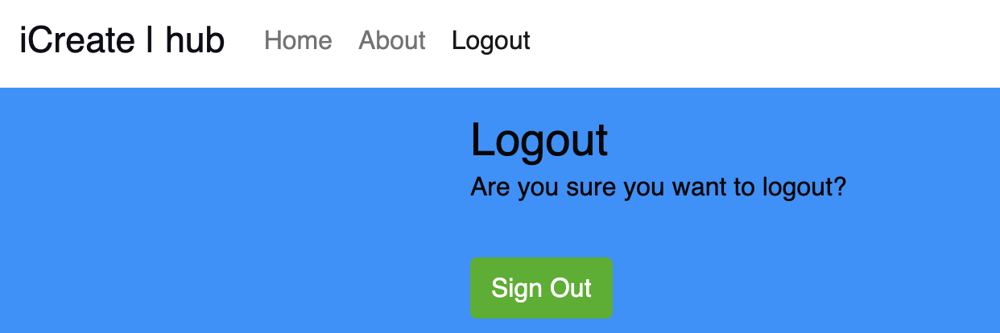

<h1 align="center">iCreate</h1>                                      

This project utilises a full-stack framework, incorporating Django, Python, JavaScript, HTML, and CSS. My objective is to develop a responsive website that enables users to perform CRUD operations, as well as post, comment, and interact with events by liking or unliking them. 

**[Visit my website](https://amanda-ci-dev-full-stack-cap-a6484667fa4d.herokuapp.com/)**

### SUPERUSER CREDENTIALS:  
- username - heroku_admin 
- password - 1a2d3m4i5n
  
These will be needed to access some features of the site.

# Overview

- The website targets vulnerable and underserved youth, offering a platform for lifelong skill development similar to Boys and Girls Scouts. My mission is to expand events into an online hub where participants earn badges by mastering skills, fostering interaction, and applying abilities to life challenges. Youth aged 6-18 can transition and grow in a safe space. 
The age limit of 18 years old aligns with the legal definition of adulthood in the USA, which is why it's applicable for the websites purposes.

- The name iCreate embodies the boundless potential within each individual child to shape their own reality, transcending limitations imposed by environment or resources. It stands as a powerful affirmation of personal empowerment, urging individuals to craft their unique selves without constraints.

- It's important to note that while this project is currently developed solely for educational purposes, it will be further developed for future use by my children and for volunteer work with youth through an established organisation.

# Table of Contents

1. [UX](#ux)
    - [User Stories](#user-stories)

2. [Scope](#scope)
    - [Features](#features)
    - [Future Features](#future-features)

3. [Structure](#structure)

4. [Wireframes](#wireframes)

5. [Database schema](#database-schema)

6. [Surface](#surface)

7. [Technologies Used](#technologies-used)

8. [Testing](#testing)

9. [Deployment](#deployment)

10. [Credits](#credits)

#
# UX

Applying fundamental UX principles, I initially focused on devising a strategy by identifying the target audience and determining the features that would offer them the most value.

The target audience for 'iCreate Youth' includes:

- Youth aged 6-18 years old, aiming to engage them in constructive and educational activities.
- Individuals seeking to explore their creativity and develop new skills.
- Students looking for opportunities to participate in events and workshops relevant to their interests.
- Guardians interested in providing their children with enriching experiences and learning opportunities.

These users will be looking for:

- An engaging and interactive website tailored to their age group.
- Opportunities to explore various interests and hobbies through workshops and events.
- A platform where they can register for events and courses easily.
- Features to track their progress and achievements, such as earning badges or certificates.
- A user-friendly interface with intuitive navigation to access content and resources.
- The ability to post, comment and like events an provide feedback reviews.
- Functionality to manage their registrations, including canceling or rescheduling participation as needed.

This website will provide all of these features while ensuring a safe and supportive online environment for youth to 
learn, explore, and grow. Additionally, it will incorporate CRUD functionality to allow administrators to manage workshops, courses, registrations, and user data effectively.

## User Stories

**Epic: Admin**
- As a site Admin I can create, edit and delete events and comments so that I can manage the site content
- As a site Admin I can access the admin panel so that I can manage events and comments
- As a site Admin I can log out of the admin panel so that I can disconnect from the website
- As a site Admin I prioritise implementing measures to safeguard youth data and ensure compliance with privacy 
  regulations, demonstrating our commitment to protecting user information. 
- As a site Admin I prioritise the inclusion of diverse and inclusive content on the website, ensuring that resources, 
  events, and services cater to the varied needs and backgrounds of our youth population, promoting accessibility and equity.
- As a site Admin I seek to establish partnerships with local teachers, therapists, and licensed professionals to expand 
  the range of services and resources available to youth on our platform, enriching the overall wellness experience and promoting collaboration within the iCreate hub.

**Epic: User Interaction**
- As a logged-in User I can attend events so that I can join events easily using a simple button
- As a logged-in User I can delete attend events so that I can change my mind to attend events easily using a simple button
- As a logged-in User I can create reviews on events so that I can leave my feedback
- As a logged-in User I can read reviews on events so that I can leave my feedback
- As a logged-in User I can update reviews on events so that I can change my feedback
- As a logged-in User I can delete reviews on events so that I can remove my feedback
- As a logged-in User I can like and unlike events so that I can mark which events I like
- As a User I can view the number of likes on events so that I can see which events are the most popular
- As a User I can view comments on events so that I can read other users opinions

**Epic: User Events**
- As a young user, I want to explore captivating event details presented on flip cards, so that I can click on the "View Details" button for more information.
- As a logged-in User I can post a event so that other users can see them to sign up
- As a User I can delete my events so that I can remove any unwanted events that I have made
- As a User I can edit events so that I can update any changes or mistakes to my events
- As a logged-in User I can upload an image along with my event so that other users can see an image relating to the event

**Epic: Login/Register**
- As a User I can register for an account so that I can interact with the site content
- As a User I can log in/out off my account if I wish so that I can connect or disconnect from the website
- As a User I can easily see if I'm logged-in or logged-out so that I can be sure what my status is

**Epic: Navigation**
- As a young user aged 6-18, I want the navigation of the iCreate platform to be designed with my needs in mind so that I can easily find and access the content I'm interested in.
- As a young user aged 6-18, I want the navigation of the iCreate platform to work seamlessly on all devices, including smartphones and tablets, so that I can access the platform from anywhere.
- As a young user aged 6-18, I want the navigation menu of the iCreate platform to be organised into clear categories like Events, About, Resources, Login, Logout so that I can quickly navigate to the content I want to explore.
- As a young user aged 6-18, I want the navigation of the iCreate platform to use engaging visuals, icons, and colours to make it visually appealing and attractive to me.
- As a young user aged 6-18, I want the navigation elements of the iCreate platform to be consistent across different pages so that I can easily understand and navigate the website.
- As a young user aged 6-18, I want the navigation of the iCreate platform to be accessible to users with disabilities, including features like keyboard navigation and screen reader compatibility, so that all users can use the platform effectively.

#
# Scope 

## **Features**

### **Home Page**

1. **Navigation Bar**
   - The navigation bar appears on every page so users can easily navigate through the site
   - Navigation bar has links for 'Home', 'About' and 'Login/Register' more links will be shown to logged in users
   - If the user is logged in then the left side of the menu shows links for pages that only authorised users can visit 
   - The user name will also appear on the bar, indicating which user is logged in
   - The navbar is fully responsive, collapsing into a hamburger menu for medium and small screen size

   

2. **Landing Page - Event Flip Cards**
   - The landing area showcases interactive flip cards designed for children to rotate 180°. The front side displays event images to capture their interest.
  
   

- Upon flipping, they unveil event details on the reverse side, succinctly showcasing the event's specific information such as time, date, location, and a brief description. This effectively communicates the website's purpose and the specific event offerings. Additionally, each card includes a 'View Details' button for further inquiry.

- View Event Details: Attend Event Button and Like Counts.

- Event Details: Remove Attend event Button and Like Counts.

- Event Review Functionality: Users have the ability to leave detailed reviews for events they have attended.

- Event Review Management: Users have the ability to edit and update their reviews, ensuring that their feedback remains accurate and current. Each review is associated with the user's name and timestamp, providing transparency and accountability.

- Event Review Management: Users are empowered to delete their reviews, granting them control over the content they contribute. This feature ensures that users can maintain the relevance and accuracy of reviews over time, enhancing the overall quality of feedback available on the platform.

3. **Footer**
   - The footer, present on all pages, comprises two sections: one containing social media link to GitHub, and the other acknowledging the website project portfolio by name.

  

  
  
 

4. **Home Page - ‘Home’**
   - A curated collection of images, organised into categories represented by flip cards corresponding to various events hosted on the platform. Each flip card displays an image relevant to the event it represents, providing users with a visual overview of the available activities. These flip cards serve as a convenient way for young users to browse through the different events and select those of interest to them.
   - The Login / Register button will take users to the login page, if users do not have an account there is a link to the registration page

  
   
 

5. **About Page - ‘About’**
   - The About Page provides detailed information about the website, specifically tailored to engage young readers. Visitors can learn about the platform's purpose and its commitment to fostering creativity and learning among children.

   

  
   
 

   -  Additionally, the page offers a platform for individuals to connect with the iCreate hub by sharing their expertise through specialised classes and workshops. Users can fill out a form with their details, which will be promptly reviewed by the website administrators.

   

  
   
 

   

  
   
 

6. **Register Page - ‘Register’**
   - The register page allows users to create a new account by providing necessary information such as username, email, password, and optional profile details.

   

  
   
 

7. **Login - ‘Login’**
   - Include username and password fields, a remember me option, error handling for incorrect credentials, a login button, links for forgot password and registration, security measures like CAPTCHA or two-factor authentication.

   

  
   
 

## Design

### Imagery
- The design layout features a clean and minimalistic structure with a simple background, providing a visually uncluttered canvas. The imagery seamlessly integrates with a striking futuristic gaming design, elevating the overall visual appeal.

### Typography
- Google Fonts were used to import the Julius font into styles.css. Chosen for it's simple, unembellished, minimalistic feel that is easy to read. Special Font for "Event" on Home Page: Lexend

### Future Features
- Audio & Video books, music, educational tutorials tailored for children
- User Settings: Parental Permission for Safe Hub, a platform similar to Facebook but designed specifically for kids
- Blog Post for children by children
- Awards and Certificates to Print
- Implement a JavaScript mouseover sound feature, activating a flip card action to reveal the other side when hovering over or clicking the card at 180 degrees.
- I'll be incorporating more flip event cards for upcoming events, making them easily accessible with a "Next" button below and a "Previous" button for scrolling through the pages.More events that will be easy to find using a next button below and previous button to scroll through the pages.

#
# Structure

The MVP website for youth aged 6-18 is structured to be intuitive and engaging, with clear navigation and visually appealing design elements. The platform prioritises simplicity and ease of use, ensuring that young users can easily navigate, interact with content, and participate in various activities tailored to their age group. Additionally, the website emphasises safety and accessibility, providing a secure environment for youth to explore, learn, and engage with the platform's offerings. Simplicity helps young users to quickly and easily access the app and navigate within the app.

The website comprises two applications:

- Event: The event app oversees Create, Read, Update, and Delete operations, along with managing notifications, for all event-related content. Additionally, it incorporates review functionality for events and includes a feature to count likes, all with the aim of delivering a user-friendly experience tailored for young users while ensuring smooth interaction with the platform.

- About: The "about" app provides website details and empowers professional instructors/users to showcase their skills and organise events. Its objective is to promote engagement with the iCreate hub by facilitating workshops, knowledge sharing, and collaboration to nurture personal and professional growth through specialised classes and meaningful interactions. This page features a form for users to offer their workshops and events. 

# Wireframes
All wireframes were created used [Balsamiq](https://balsamiq.com/)

Wireframes for each device are linked here:
- [Desktop](assets/documents/Desktop-wireframes)
- [Tablet](assets/documents/Tablet-wireframes)
- [Mobile](assets/documents/Mobile-wireframes)

# Database schema
Prior to initiating any model migrations to my database, I devised an entity relationship diagram to visualise the connections between the models.

The entity relationship diagrams were created using [Lucidchart](https://www.lucidchart.com/).

## Models
### **Event Model**

### **Reviews Model**

### **About Model**

### **SubmitDetails Model**

## Font 
- Main Font: Julius, sans-serif
- Special Font for "Event" on Home Page: Lexend

## Technologies Used

### Languages Used
- [HTML5](https://en.wikipedia.org/wiki/HTML5)
- [CSS3](https://en.wikipedia.org/wiki/CSS)
- [JavaScript](https://www.javascript.com/)
- [Python](https://www.python.org/)

 ## Frameworks, Libraries & Programs Used

[GitHub](https://github.com/) - GitHub is a web-based platform for version control using Git, enabling collaborative software development and hosting of code repositories. GitHub connects to GitPod and Heroku. *****ADD HOW IT HELPED HERE ON EACH LINK****

[GitPod](https://gitpod.io/workspaces) – Connected to GitHub, GitPod hosted the coding space, allowing the project to be built and then committed to the GitHub repository. 

[Heroku](https://www.heroku.com/) - Connected to the GitHub repository, Heroku is a cloud application platform used to deploy this project so the backend language can be utilised/tested. 

[Django](https://www.djangoproject.com/) - Django is a high-level web framework for building web applications rapidly with a clean and pragmatic design.

[ElephantSQL](https://api.elephantsql.com) - ElephantSQL is a hosted PostgreSQL database service that can be seamlessly integrated with Django applications, providing scalable and reliable database solutions.

[Gunicorn](https://gunicorn.org/) - Gunicorn is a pure-Python HTTP server for WSGI applications.

[Dj Database URL](https://pypi.org/project/dj-database-url/) - This allows you to utilise the 12factor inspired DATABASE_URL environment variable to configure your Django application.

[Bootstrap](https://getbootstrap.com/) - Bootstrap is a front-end framework for developing responsive and mobile-first websites quickly and efficiently.

[Cloudinary](https://cloudinary.com) - Cloudinary is a cloud-based media management platform that offers solutions for storing, optimising, and delivering images and videos for web and mobile applications.

[Summernote](https://summernote.org/) - Summernote is a Django app that enables users to easily integrate a rich text editor into their web applications, enhancing event creation and description functionality.

[DALL-E3](https://openai.com/) - DALL-E3 is an advanced AI model developed by OpenAI that generates images from textual descriptions.

[TinyPNG](https://tinypng.com/) - TinyPNG is a website that offers image compression services to optimise image files for faster loading on webpages while maintaining visual quality.

[Google Fonts](https://fonts.google.com/https://fonts.google.com/) - Google Fonts is a collection of free, open-source fonts that can be easily integrated into websites and other digital projects to enhance typography.

[Font Awesome](https://fontawesome.com/) - Font Awesome is a library of scalable vector icons that can be easily customised and used to enhance the visual appeal of websites and applications.

[Beautify](https://www.jpkc.com/tools/beautify/) - Beautify is a code formatter tool that automatically formats code to improve readability and consistency.

[Balsamiq](https://balsamiq.com/) - Balsamiq is a wireframing tool used for creating low-fidelity mockups of user interfaces, allowing for quick and easy visualisation of design ideas.

[Lucidchart](https://lucid.app) - Lucidchart is a web-based diagramming tool that allows users to create and collaborate on flowcharts, ERDs, and other visual representations of data and processes.

[Am I Responsive](http://ami.responsivedesign.is/) - Am I Responsive is a web tool that allows users to quickly preview how their website appears on various devices and screen sises, helping to ensure responsiveness and compatibility across platforms.

[Diffchecker](https://www.diffchecker.com/text-compare/) - Diffchecker is a text comparison tool used to highlight the differences between two blocks of text, facilitating comparison and analysis.

[W3C CSS Validator](https://jigsaw.w3.org/css-validator/) - The W3C CSS Validator is a tool used to check the validity and syntax of CSS code, ensuring compliance with web standards set by the World Wide Web Consortium (W3C).

[W3C Markup Validator](https://validator.w3.org/#validate_by_input) - The W3C Markup Validator is a tool used to check the validity and syntax of HTML code, ensuring compliance with web standards set by the World Wide Web Consortium (W3C).

[JSHint](https://jshint.com/) - JSHint is a static code analysis tool used for checking JavaScript code for errors, potential problems, and stylistic inconsistencies.

[Pep8ci](https://pep8ci.herokuapp.com/) - Pep8ci provides Python developers with a tool to check their code against the PEP 8 style guide for adherence to coding standards.

[Lighthouse](https://developer.chrome.com/docs/lighthouse) - an open-source tool used for auditing web page quality, including performance, accessibility, SEO, and cross-browser testing.

[Code Institute](https://codeinstitute.net/) - The events page on my site drew inspiration from the "I think therefore I blog" walkthrough project by Code Institute. Throughout the past 16 weeks, my participation in the Full Stack skills bootcamp has equipped me with the essential skills needed to develop this website.

### ** Below, you'll find a comprehensive list of project requirements and their respective versions. Some installed packages were not utilised but were installed as per the instructions provided by Code Institute. This influenced my decision to document the process in the **I think therefore I blog walkthrough project.** 

- asgiref==3.7.2  
- cloudinary==1.36.0  
- crispy-bootstrap5==0.7  
- dj-database-url==0.5.0  
- dj3-cloudinary-storage==0.0.6  
- Django==4.2.11  
- django-allauth==0.57.2  
- django-bootstrap-v5==1.0.11  
- django-crispy-forms==2.1  
- django-summernote==0.8.20.0  
- gunicorn==20.1.0  
- oauthlib==3.2.2  
- psycopg2==2.9.9  
- PyJWT==2.8.0  
- python3-openid==3.2.0  
- requests-oauthlib==1.4.0  
- sqlparse==0.4.4  
- whitenoise==5.3.0  

# Testing *****THIS SECTION IS STILL BEING WORKED ON*******

## User Story Testing

## User Stories, features and bugs

<table>
  <tr>
    <th>User Story</th>
    <th>Features</th>
    <th>Bugs / Issues - tested across viewports of all devices using Google Dev Tools</th>
  </tr>
   <tr>
    <td>As a young user, I want to explore captivating event details presented on flip cards, so that I can click on the "View Details" button for more information.</td>
    <td>Interactive flip cards designed for children to rotate 180°.The front side displays event images to capture their interest. Back side displays details including a 'view details' button.</td>
    <td>The display would not flex to row.</td>
  </tr>
  <tr>
    <td>As a young user, I want to explore captivating event details presented on flip cards, so that I can click on the "View Details" button for more information.</td>
    <td>Interactive flip cards designed for children to rotate 180°. The front side displays event images to capture their interest. Back side displays details including a 'view details' button.</td>
    <td>The brief description overflowed flip cards</td>
   </tr>
   <tr>
    <td>As a logged-in User I can attend events so that I can join events easily using a simple button</td>
    <td>The button system displays attendees.. Organisers know who is attending.</td>
    <td>On event detail page attending button unresponsive</td>
   <tr>
    <td>As a logged-in User I can delete attend events so that I can change my mind to join events using a simple button</td>
    <td>Event view details page with event displayed. The button system displays cancelled attendees.</td>
    <td>Event system by attendees unresponsive. Organisers know who is cancelled attending.</td>
   </tr>
   <tr>
    <td>As a young user aged 6-18, I want the iCreate platform's navigation to be seamless across all devices, enabling me to access it from anywhere, including smartphones and tablets.</td>
    <td>Study my skills anywhere Easy mobile accessibility</td>
    <td>None detected.</td> 
   </tr>
  <tr>
    <td>As a Organiser I can create events so that users can attend them.</td>
    <td>Specify date, time, location, course or interest, and max. participants. List of users attending. Add an event picture.</td>
    <td>None detected</td>
    </tr>

  <tr>
    <td>As a user, I want the site to be easily navigable.</td>
    <td>Different features of site are clearly identifiable</td>
    <td>None detected</td>
    
  </tr>
  <tr>
    <td>As a site Admin I prioritise the inclusion of diverse and inclusive content on the website, ensuring that resources, 
  events, and services cater to the varied needs and backgrounds of our youth population, promoting accessibility and equity.</td>
    <td>Minililistic design Simple font and layout</td>
    <td>None detected</td>
    
  </tr>
  <tr>
    <td>As a User I can log in/out off my account if I wish so that I can connect or disconnect from the website.</td>
    <td>Success notifications to alert user</td>
    <td>None detected</td>
    
  </tr>
  <tr>
    <td>As a user, I want the site to be visually appealing.</td>
    <td>Blue: Calming, reduces stress, promotes relaxation, trust, stability for kids  Children enjoy flip cards because they offer interactive engagement and surprise through flipping actions, along with colorful and visually appealing designs.
    </td>
    <td>None detected</td>
</tr>
  </table>

 

### User Stories and Features (to be implemented next Sprint) 

  <table>
  <tr>
    <th>User Story</th>
    <th>Features</th>
    <th>Bugs / Issues</th>
  </tr>

  <tr>
    <td>As a user I want to able to search filter events so that I can attend events of my interest.</td>
    <td>Filter by category, words or interests.</td>
    <td>N/A</td>
  </tr>
  
  <tr>
    <td>As a Student I can get notified of upcoming events so that I am less likely to miss or forget the event.</td>
    <td>Get notifications from upcoming events.</td>
    <td>N/A</td>
  </tr>

  <tr>
    <td>Implement a JavaScript mouseover sound feature, activating a flip card action to reveal the other side when hovering over or clicking the card at 180 degrees.</td>
    <td>Add to the fun experience for children</td>
    <td>N/A</td>
  </tr>

  <tr>
    <td>Award certificates and badges upon completing tasks and mastering skills on the platform so that I am motivated to continue learning and engaging with the platform's activities</td>
    <td>/Motivate to continue learning and engaging with the platform's activities</td>
    <td>N/A</td>
  </tr>
  

  </table>

### Won't haves

  <table>
  <tr>
    <th>User Story</th>
    <th>Features</th>
    <th>Bugs / Issues</th>
  </tr>
  <tr>
    <td>As a user I want to be able to friend other users</td>
    <td>friend option.</td>
    <td>N/A</td>
  </tr>

## Fixed Bugs / Issues
 
<table>
  <tr>
    <th>Bug/Issue</th>
    <th>Image</th>
    <th>Resolution</th>
  </tr>
  <tr>
  <td>Back side flip card overflows card</td>
    <td></td>
    
  <td>I added media queries to ensure effective responsiveness</td>
  </tr>
  </table>

## Unfixed Bugs / Issues
<table>
  <tr>
    <th>Bug/Issue</th>
    <th>Image</th>
    <th>Resolution</th>
  </tr>
  <tr>
  <td>On table devices the display is not centered on the screen using bootstrap</td>
    <td></td>
    
  <td>Due to time constraints, I could not address the slight misalignment of the Bootstrap responsiveness for iPad. I plan to rectify this in the next sprint.</td>
  </tr>
</table>

**EPIC: Superuser / Admin**
- As a site Admin I can create, edit and delete events and comments so that I can manage the site content
- As a site Admin I can access the admin panel so that I can manage events and comments
- As a site Admin I can log out of the admin panel so that I can disconnect from the website

This was tested by accessing the Django Admin Panel. By creating a Superuser I can access the Django Admin Panel where the administrator can perform all the CRUD functionalities.

**EPIC: User Interaction**
1. As a logged-in User I can write reviews on events so that I can leave my feedback

2. As a logged-in User I can like and unlike events  so that I can mark which events I like

3. As a User I can view the number of likes on events so that I can see which events are the most popular

4. As a User I can view comments on events so that I can read other users opinions

**EPIC: User Events**
1. As a logged-in User I can create events so that other users can see them

2. As a User I can delete my event so that I can remove any unwanted events that I have made

3. As a User I can edit events so that I can update any changes or mistakes to my events 

4. As a logged-in User I can upload an image along with my event so that other users can see what the event theme looks like

**EPIC: Login/Register**
1. As a User I can register for an account so that I can interact with the site content

2. As a User I can log in/out off my account if I wish so that I can connect or disconnect from the website

3. As a User I can easily see if I'm logged-in or logged-out so that I can be sure what my status is

**EPIC: Navigation**
1. As a User I can easily navigate through the site so that I can view desired content

2. As a User I can see the most loved events so that I can quickly join in 

### Validator Testing

#### HTML Validator
- [Results for event_list.html](#)
- [Results for event_detail.html](#)
- [Results for event_form.html](#)

#### CSS Validator
- [Results for styles.css](#)

#### Browser Compatibility
- Chrome Version 90.0.4430.212
- Firefox Version 88.0.1
- Safari on macOS Catalina (Safari Version 14.0.3)

### Test Cases and Results
- [Test Cases](#)

## Bugs and Issues
- I'm experiencing an unresolved bug related to Bootstrap slight responsiveness on a tablet.
- User image uploads weren't uploading to Cloudinary. To fix this I added  at the top of the file
- The  button on the form was not responding
- The front flip cards were not displaying the image. To fix this I included the  at the top of the file
- The back flip cards were not displaying the text correct. To fix this I reduced the text in admin
- *****CHECK THE FIX COMMITS IN REPO*****

# Deployment

## How this site was deployed
Here are the basic steps for deploying a project from Gitpod to Heroku and linking it to GitHub using manual deployment:

## Prepare Your Project:

- Ensure your project is ready for deployment and is working as expected locally.
Make sure your project includes a requirements.txt file listing all the dependencies and a Procfile to specify the command to start the web server.

## Create a GitHub Repository:

- If you haven't already, create a GitHub repository for your project.
Push your project code to this GitHub repository.

## Set Up Heroku Account:

- Sign up for a Heroku account.
Install the Heroku CLI (Command Line Interface) on your local machine.

## Create a New App on Heroku:

- Log in to your Heroku account via the terminal using the Heroku CLI.
Create a new app on Heroku using the heroku create command.

## Link Heroku App to GitHub Repository:

- Go to the "Deploy" tab of your Heroku app dashboard.
Under "Deployment method," select GitHub as the deployment method.
Search for your GitHub repository and connect it to your Heroku app.

## Enable Manual Deployment:

- Disable automatic deploys to ensure that changes pushed to your GitHub repository do not trigger automatic deployments on Heroku.
You can do this by clicking on the "Enable Automatic Deploys" button and then turning off the "Wait for CI to pass before deploy" option.

## Deploy Your App:

- Manually deploy your app by clicking the "Deploy Branch" button in the "Manual deploy" section.
Choose the branch you want to deploy from (e.g., main or master).

## Wait for Deployment:

- Wait for the deployment to finish, and check the logs for any errors.

## Test Your Deployed App:

- Once the deployment is complete, open your app using the provided Heroku URL and test that it works as expected.
By following these steps, you can manually deploy your project from Gitpod to Heroku and link it to GitHub for version control.

- Once the master branch has been selected, the page will be automatically refreshed with a detailed ribbon display to indicate the successful deployment.

- Any changes pushed to the master branch will take effect on the live project.

The live link can be found [https://github.com/AmandaCIdev/iCreate](#).

## How to clone the repository
1. Go to the GitHub repository on GitHub.
2. Click the "Code" button to the right of the screen, click HTTPs and copy the link there.
3. Open a GitBash terminal and navigate to the directory where you want to locate the clone.
4. On the command line, type "git clone" then paste in the copied URL and press the Enter key to begin the clone process.

## Django and Heroku 
- I followed the Code Institute's Coding Coach instructional video to install and set up the Django framework.
- 

# Credits
- [Django Crispy Forms] (https://django-crispy-forms.readthedocs.io/en/latest/install.html) - Instructional Documentation assisted me.
- [Whitenoise Docs] (https://whitenoise.readthedocs.io/en/latest/django.html) - Instructional Documentation help but deleted due to bug
- [Pop. ai] (https://www.popai.ai) - Assisted me with grammer for the README overview
- [Stack Overflow] (https://stackoverflow.com) - The Crispy Forms instructions assisted me.
- [ChatGPT] (https://chat.openai.com) - Providing guidance whenever I encountered code I did not grasp.
- [DALL-E 3](https://openai.com/dall-e-3) - Converted all my textual ideas into visual images.
- [W3Schools](https://www.w3schools.com/howto/howto_css_flip_card.asp) - W3Schools provided me guidance on creating flip cards, which I incorporated into the website design.
- [StackOverflow](https://stackoverflow.com/questions/70102494/toggle-flip-cards) - StackOverflow offered me insights on implementing JavaScript for toggle flip cards, enhancing the functionality of the website.

## Media
- The icon in the footer were taken from Font Awesome.
- The fonts used were imported from Google Fonts.
- My images including favicon were all created by DALL-E 3.

## Acknowledgments
- I am grateful to my mentor for providing valuable feedback.
- Coding coach Kevin, for his very helpful SME videos.
- Thank you to members of my cohort and cohort facilitator for their continued support throughtout this course.

